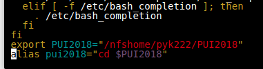
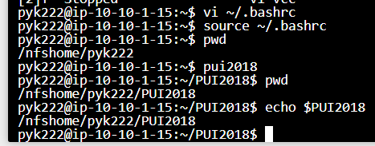

# HW1 PYK222

**For the images below, I accessed using my CUSP|ADRF**

I first created a new terminal on my ADRF

Then I use ```mkdir``` to create PUI2018

Then I ```cd``` into the PUI2018 folder

Then I played around with setting up a temporary environmental variable, by typing ```echo $PUI2018``` and ```export PUI2018='/nfshome/pyk222/PUI2018'``` on the terminal

Then I tried using ```nano .bashrc``` and typed the image below, which did not work.

With a suggestion by other students, I typed in ```vi ~/.bashrc``` to access the bash, and inputting the image below, it worked. I saved and quit the bash with ```:wq``` 



On the terminal, I typed 


``` 
pwd

pui2018

pwd
```

and it worked, as seen from the second screenshot. 



Also in HW1 folder is the extra credit

To set up this repository, I used ```mkdir``` to create PUI2018_pyk222 as well as the HW1 folder.

Then I used ```git init``` and ```git status``` and created README.md files using ```touch```. Then I created the repository on github, add, commit, and pushed it on there. I did the same thing adding the images to the repository as well.

**Author Information**

Po-Yang Kang: I created my repositories, images, extra credit and README.md.

Borong Lyu: Forked her repository with mine, also suggested I should use ```vi``` instead of ```nano``` to access the bashrc.
