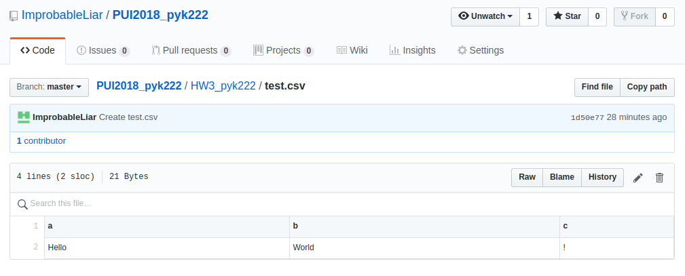
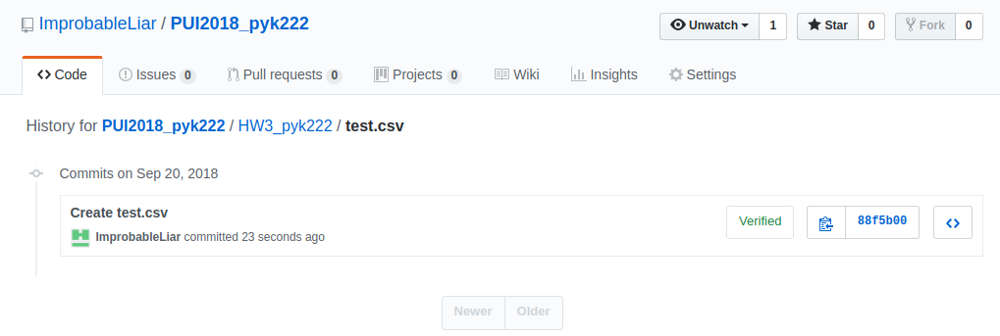
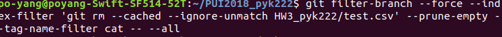
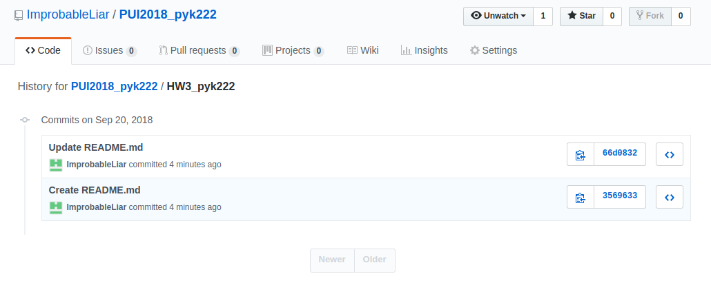

# Homework Week 3

**Assignment 1:**

This README was made after I created a 'test.csv' with this folder on gitHub so when the test.csv file is removed, the folder isn't gone as well, since gitHub deletes folders without any file in them

After I created a 'test.csv' file, input the content, and took a screenshot of the content and the history:





I pulled the changes to my desktop and input the following commands in the terminal to remove the file and history:

```git filter-branch --force --index-filter 'git rm --cached --ignore-unmatch HW3_pyk222/test.csv' --prune-empty --tag-name-filter cat -- --all```



Then I checked the gitHub repository for the folder's history:



**Assignment 2**
Used the E-Designations Data from NYC Open Data for the assignment. Created scatter plots for both the homework and extra credit, on the CUSP ADRF, with titles and captions for the necessary graphs. Headers were missing for the JSON file so I had to create headers for it. 

**Assignment 3**
Used the fedhere/UInotebooks/dataWrangling/ repository to do this assignment. Created show_bus_locations_pyk222.py on the CUSP ADRF. Can access it using the terminal with
```python show_bus_locations_pyk222.py <MTA_KEY> <BUS_LINE>``` and print out the latitude and longtitude of the buses on the line, as well the number of busses and the line name itself. 

My MTA Key is 8dddf24d-3719-4eaf-9d47-e6eed4ccafac, but I made it so any MTA key can be used.

**Assignment 4**
Used the fedhere/UInotebooks/dataWrangling/ repository to do this assignment. Created get_bus_info_pyk222.py on the CUSP ADRF. Can access it using the terminal with
```python show_bus_locations_pyk222.py <MTA_KEY> <BUS_LINE> <BUS_LINE>.csv``` and print out the Latitude,Longitude,Stop Name, and Stop Status of that bus line on a csv file that is existing, and if not, then it creates one. 

**Author Information**

I was originally working with Borong Lyu, but aside from Assignment 2 where we both chose the same E-Destinations data, we mostly worked on our own, while consulting each other for help. 

Po-Yang Kang: Did almost everything by myself

Borong Lyu: In Assignment 1, suggested that I should use a special kind of scatter plot in the extra credit portion. In Assignment 3, helped clarify for me the keys and the lists in the MTA API.
