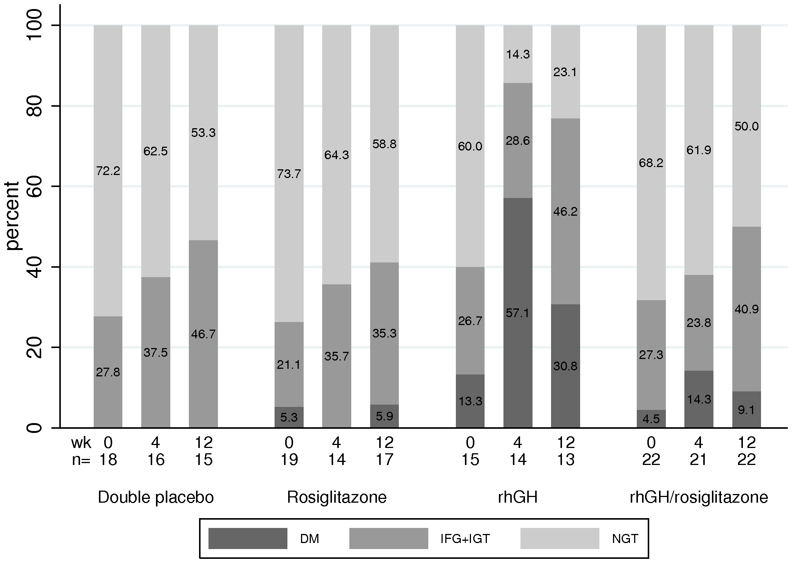
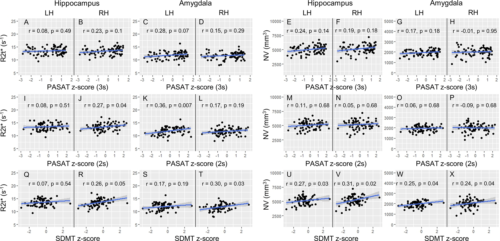
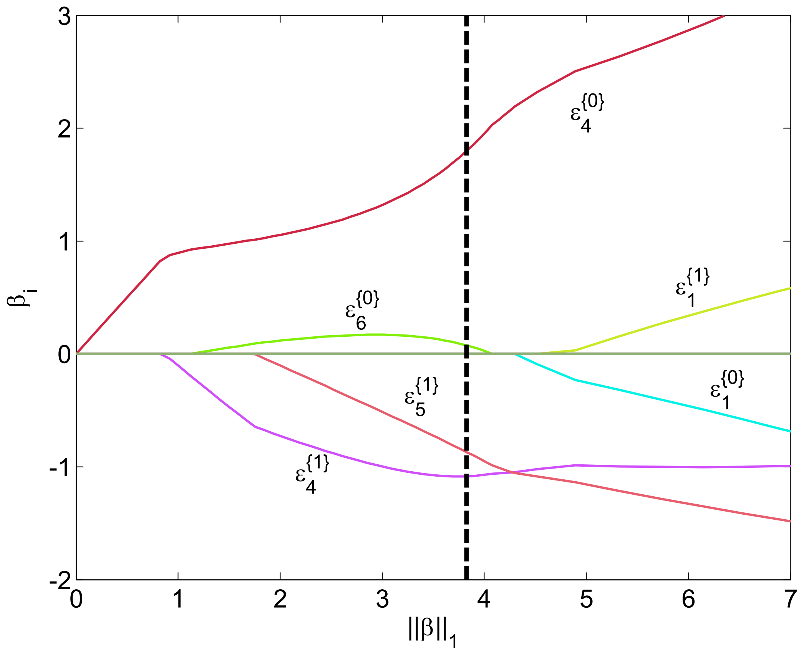

Did everything by myself.

Followed the directions for Assignment 3 and 4.

Assignment 2 I also did by myself for these three tests.

### ANCOVA: 

| **Statistical Analyses**	|  **IV(s)**  |  **IV type(s)** |  **DV(s)**  |  **DV type(s)**  |  **Control Var** | **Control Var type**  | **Question to be answered** | **_H0_** | **alpha** | **link to paper**| 
|:----------:|:----------|:------------|:-------------|:-------------|:------------|:------------- |:------------------|:----:|:-------:|:-------|
ANCOVA| 2,  receive rhGH, rosiglitazone, combination rhGH/ros, or placebo daily?| categorical| 1, percent changes in SI glucose homeostasis after receiving IV(s) by checking their diabetes mellitus (DM), impaired fasting glucose (IFG), impaired glucose tolerance (IGT), and normal glucose tolerance (NGT)| continuous |1, all participants are HIV-infected, obese, and insulin-resistent| categorical| 	Do participants receiving rosiglitazone and/or rhGH have significant changes in insulin sensitivity (SI) than the control group?| SI test groups = SI control group| 0.05 | [Recombinant Human Growth Hormone and Rosiglitazone for Abdominal Fat Accumulation in HIV-Infected Patients with Insulin Resistance: A Randomized, Double-Blind, Placebo-Controlled, Factorial Trial](https://journals.plos.org/plosone/article?id=10.1371/journal.pone.0061160) |
  |||||||||
  
  
  ### Main plot of the paper for ANCOVA: 

!

  ### Correlation: 

| **Statistical Analyses**	|  **IV(s)**  |  **IV type(s)** |  **DV(s)**  |  **DV type(s)**  |  **Control Var** | **Control Var type**  | **Question to be answered** | **_H0_** | **alpha** | **link to paper**| 
|:----------:|:----------|:------------|:-------------|:-------------|:------------|:------------- |:------------------|:----:|:-------:|:-------|
Correlation| 1, processing speed measured in PASAT and SDMT units| continuous| 1, loss of tissue in tissue-specific parameter (R2t*) units| continuous|1, controlled for gender and mental health (Specifically patients with RRMS, SPMS, or PPMS)| categorical| How strongly and in what direction do processing speed and loss of tissue in the limbic system correlate| Processing speed coefficient = 0| 0.05 | [Limbic system damage in MS: MRI assessment and correlations with clinical testing](https://journals.plos.org/plosone/article?id=10.1371/journal.pone.0187915) |
  |||||||||
  

  ### Main plot of the paper for Correlation: 

!

  ### Logistic Regression: 

| **Statistical Analyses**	|  **IV(s)**  |  **IV type(s)** |  **DV(s)**  |  **DV type(s)**  |  **Control Var** | **Control Var type**  | **Question to be answered** | **_H0_** | **alpha** | **link to paper**| 
|:----------:|:----------|:------------|:-------------|:-------------|:------------|:------------- |:------------------|:----:|:-------:|:-------|
Logistic Regression| 1, patient's flow cytometry measurements| continuous| 1, Acute Myeloid Leukaemia (AML) positive or negative| dichotomous|NaN|NaN| What is the odds probability of AML occuring when the values of flow cytometry measurements change| Flow cytometry coefficient = 0| 0.01 | [Leukemia Prediction Using Sparse Logistic Regression](https://journals.plos.org/plosone/article?id=10.1371/journal.pone.0072932) |
  |||||||||
  
  
   ### Main plot of the paper for Correlation: 

!