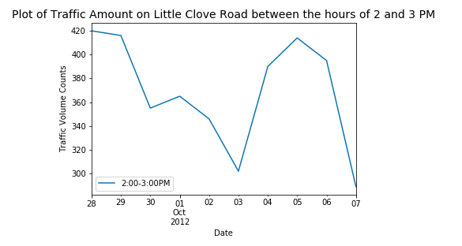

##Homework 8 Assignment 1

The source of this data is from 

https://data.cityofnewyork.us/Transportation/Traffic-Volume-Counts-2012-2013-/p424-amsu

of NYC traffic from 2012-2013 on streets where they have censors. 

I did everything myself here. 

##Homework 8 Assignment 2

Link to paper: 

https://www.authorea.com/335948/nrA-B7cJXZrVMRxa8fOE4Q

Used K-S test and the t-test the assigned classmate suggested I do. I agree with him.
Also changed my null and alternative hypothesis from a one-tailed to a two-tailed one to test the K-S test. 

I did everything myself here.

